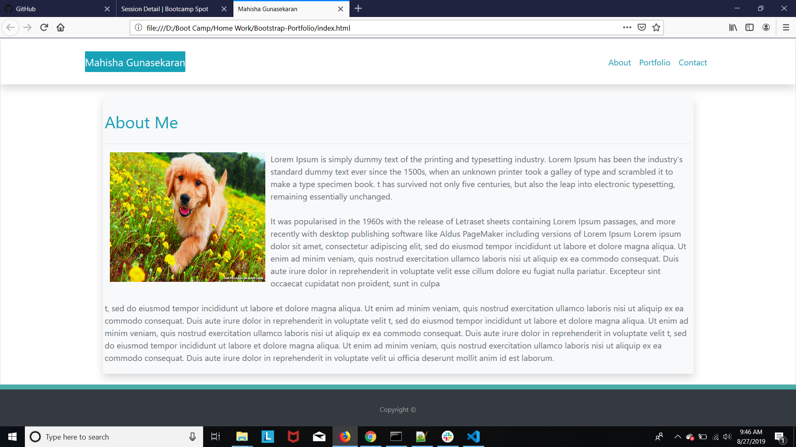
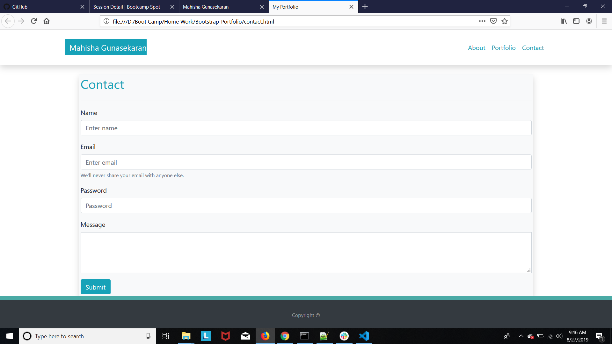
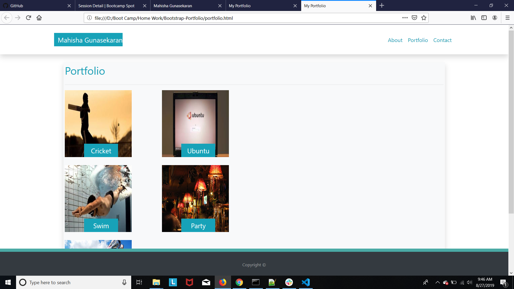

# Bootstrap Portfolio

## Site pictures




## Technologies Used
- HTML : used to create elements on the DOM
- Bootstrap : to style html pages and to be page responsive
- Git : version control system to track changes to source code
- GitHub : hosts repository that can be deployed to GitHub pages

## Summary
### Built a professional portfolio site using HTML/Bootstrap. This website basically has three web pages linked to each other. Applied different concepts like bootstrap, padding, margins to be responsive and neat

## Code Snippet
```HTML
  <div class="container-fluid">
          <!--First Row-->
        <div class="row">
        <nav class="navbar navbar-expand-lg navbar-light bg-dark sticky-top fixed-top navbar-custom col-sm shadow p-4 ml-0 bg-white"role="navigation">
             
                <!--First column-->
                <div class="col-md-1"></div>
                <!--Second column-->
                <div class="col-md-6">
        <a class="w-1 bg-info text-light navbar-brand" href="#"id="name"role="navigation"> Mahisha Gunasekaran </a>
```


## Author Links
[LinkedIn](https://www.linkedin.com/in/mahisha-gunasekaran-0a780a88/)

[GitHub](https://github.com/Mahi-Mani)

